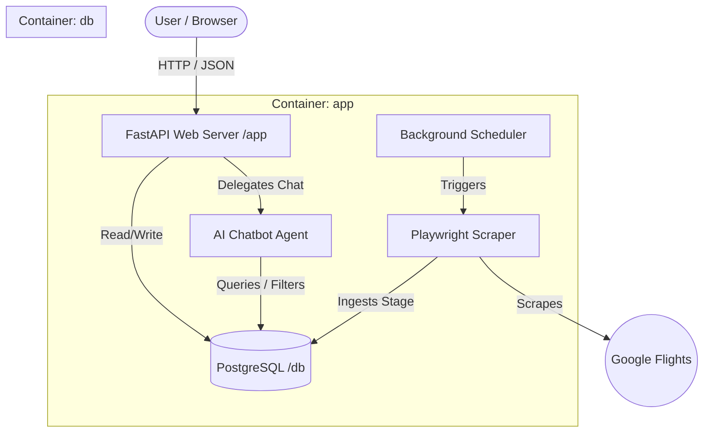

# Approach & System Design: SFO Anywhere Flights

## 🎯 Problem Statement & Choices

I built a **Reverse-Engineered Flight Discovery Engine** combined with a **Mini-App Assistant**. 

### The GDS API vs. Reverse-Engineering Choice
Commercial flight APIs (e.g., Amadeus, Sabre, Skyscanner) are unsuitable for this type of project:
* They charge steep transactional GDS fees.
* Their sandboxes return stale, cached pricing.
* They enforce rigid schemas that prevent flexible "anywhere" open-ended discovery queries.

Google Flights is the gold standard for speed and depth, but it is notoriously difficult to scrape because it uses:
1. **Wiz Binary Streams**: Data is streamed in chunks via XHR/Fetch using a proprietary Google "Wiz" format containing nested, double-serialized JSON and base64-encoded Protobuf payloads.
2. **Aggressive Anti-Bot Mechanisms**: Dynamic selectors, JavaScript behavior checks, and rate-limiting.

By injecting a Javascript hook into the Playwright browser context to intercept these Wiz streams at the browser level and decode the Protobuf payloads on the fly, this engine obtains real-time flight options and feeds them into a FastAPI backend with a Gemini-powered "agentic" assistant.

---

## 🏗️ Architectural System Design

The application consists of a modular React frontend and a FastAPI backend connected to an OLTP PostgreSQL database, all running isolated inside a multi-container Docker environment.

### Core Components
* **Playwright Scraper**: Intercepts binary streams and ingests raw flight logs.
* **Background Scheduler**: Periodically triggers the pipeline every 12-24 hours.
* **FastAPI Server**: Exposes API endpoints for flights, scraper status controls, and chatbot conversations.
* **AI Chatbot Agent**: Extracts structured criteria to sync UI filters on the fly.
* **PostgreSQL Database**: Serves as the indexed, persistent relational store.

---

## 🛠️ Technical Implementation

### 1. The Scraper (Stream Interception)
* **Wiz Stream Interception**: Instead of parsing the DOM (which is highly brittle), a custom JS handler intercepts all outgoing `XMLHttpRequest` and `fetch` calls.
* **Protobuf Decoding**: Decodes the base64-encoded messages found inside the Wiz stream using `blackboxprotobuf` to extract clean pricing and flight details directly from the source.
* **Dynamic Airport Seeding**: The system automatically detects new airport codes in the stream to build/seed the database dynamically.

### 2. The AI Integration (Natural Language Sync)
* **Natural Language Sync**: The AI assistant (Gemini 1.5 Flash) extracts structured JSON filters (`max_price`, `destination`, `airlines`) from casual messages like *"Find me flights to London under $800"*.
* **Real-time Filtering**: The React frontend synchronizes these AI-extracted filters with the UI components (Sliders, Autocomplete) in real-time, instantly updating the DataGrid results.

### 3. Backend Architecture & Database Strategy
* **Modular Codebase**: Organized into `core` (agent logic, configuration), `db` (SQLAlchemy models and schemas), and `scraper` (ingestion, stream parser, extractor) modules.
* **Soft-Delete Strategy**: The scheduled daily ingestion task performs soft-deletes on outdated or removed flight listings by marking them with `delete_indicator = 1` rather than destroying them, preserving historical records.
* **Manual Scraper API**: Exposes `POST /api/scraper/run` to allow users to trigger data ingestion on demand.

### 4. Deployment Optimization
* **Dockerized Environment**: The entire stack builds and boots using a single `docker-compose up --build` command.
* **Production Packaging**: Includes optimized multi-stage Docker builds, `.dockerignore` filters, and Node/Python dependency caching to support instant deployments to Railway.

---

## ⚖️ Decisions & Trade-offs (PoC Constraints)

* **Tailwind CSS**: Migrated the project to **Tailwind CSS v4** for the final dashboard. This provides a utility-first approach that ensures layout consistency and rapid UI iteration, while keeping the CSS bundle size small.
* **Scheduled Ingestion vs. Live Search**: I chose a scheduled ingestion model (every 12-24 hours) for the PoC. This prevents the user from waiting 20+ seconds for a live scrape to finish and avoids triggering Google's rate limits too quickly.
* **Fixed Origin (SFO)**: Fixed to SFO for the PoC to demonstrate the "anywhere" discovery feature within a constrained scraping scope.
* **Date Range Restrictions**: Restricted searches to travel windows in the next 30 days (e.g., 1-week trips) to keep scraping load light and execution times predictable.

---

## 🚧 Operational Challenges & Scalability (Post-PoC)

### 1. Scraper Rate Limiting & Proxies
* **PoC Limit**: A single server IP address will eventually face 429 rate limits or Captchas from Google.
* **Scalability Solution**: Integrate residential proxy rotators (e.g., Bright Data, Oxylabs), rotate user-agents, and utilize stealth plugins.

### 2. Database Performance & Schema Management
* **PoC Limit**: Basic PostgreSQL database.
* **Scalability Solution**: Implement composite indexes on `(origin, destination, departure_date, price)`, partition large tables by date ranges, and use Redis to cache popular queries.
* **Database Schema Migrations**:
  * **Alembic (Industry Standard)**: Use Alembic to generate version-controlled migration scripts directly from SQLAlchemy models to keep schema changes tracked in Git.
  * **Atlas**: Use Atlas declarative migration management for infrastructure-as-code deployments.

### 3. Orchestration Complexity
* **PoC Limit**: Native background scheduling (APScheduler) running inside the main web process.
* **Scalability Solution**: Transition to an orchestrator like Apache Airflow or Prefect to manage retry policies, alert Slack channels on scraper failures, and handle dbt data transformation pipelines.

---

## 🚀 Future Roadmap

1. **Distributed Scraping**: Transition to Celery/RabbitMQ to support multiple origin cities and longer travel date windows (e.g., 3-6 months).
2. **Multi-Stop Discovery**: Enhance the Protobuf parser to extract complex multi-leg journeys and layover details.
3. **Price Alerts**: Add a user system to subscribe to AI-monitored price drops on specific routes.
