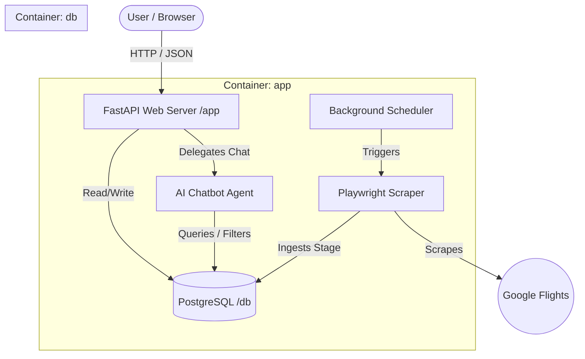

# Anywhere Flights - SFO Flights Search Engine & AI Assistant

An intelligent flight discovery dashboard and AI Assistant enabling users to find the lowest flights from SFO (San Francisco) with flexible search criteria and natural language chat synchronization.

---

## 🚀 Quick Start Guide

### 1. Set Up Environment Variables
Copy the example environment file:
```bash
cp .env.example .env
```
Open the `.env` file and insert your API key for the Gemini chatbot:
- **`GOOGLE_CLOUD_API_KEY`**: Your Gemini API Key (e.g. `AQ.Ab8RN...`)

### 2. Build and Launch the Application
Start all services (database, backend, and static file server) using Docker Compose:
```bash
docker-compose up --build
```
Once the services are running, open your web browser and navigate to:
👉 **`http://localhost:8000`**

### 3. Running Tests
To run the automated Python database and extraction test suite:
```bash
docker-compose run --rm -e PYTHONPATH=/workspace app pytest app/tests/
```

---

## ☁️ Cloud Deployment (Railway Integration)

This project is configured for seamless deployment to **Railway** via containerization. 

### 🚀 Automatic Deployment on Git Push

Once you link your GitHub repository to your Railway service, **any push to the `main` branch will automatically build and redeploy your application**:

1. **Commit and Push Changes**:
   ```bash
   git add -A
   git commit -m "feat: updates"
   git push origin main
   ```

2. **Automatic Build & Deploy**:
   - Railway will automatically detect the commit, read the `Dockerfile`, rebuild the React frontend, and deploy the new version of your FastAPI web server.

### Required Environment Variables on Railway:
Ensure these variables are set in your Railway service settings:
- **`DATABASE_URL`**: Reference to your PostgreSQL container connection string (e.g., `${{Postgres.DATABASE_URL}}`).
- **`GOOGLE_CLOUD_API_KEY`**: Your Gemini API Key (for the `gemini-3.1-flash-lite` chatbot).
- **`SCRAPE_INTERVAL_HOURS`**: `24`

---

## 🏗️ System Architecture

The project consists of three main components:
- **Frontend (React + Vite + MUI)**: Responsive split-pane dashboard. Renders an interactive flight listings table, quick filtering cards, active AI search chips, and the AI conversational chatbot panel.
- **Backend (FastAPI)**: Web server serving active flight database endpoints (`/api/flights`), pipeline audit logs (`/api/scraper/status`), conversational agent routing (`/api/chat`), and hosting compiled React assets.
- **Database (PostgreSQL)**: Stores flight details, scraper logs, and airport structures.



---

## 📝 Project Notes & Scalability (from notes.md)

### Goal
Create a flights search engine focusing on the "anywhere" discovery feature (initially from SFO), allowing users to find the lowest prices with flexible criteria and date options.

### User Requirements
- **Origin:** Fixed to San Francisco International Airport (SFO) for the PoC.
- **Date Range:** Flexible travel dates (initially restricted to the next 30 days to limit scraping load).
- **Advanced Filters:**
  - Maximum price.
  - Airline preferences.
  - Country inclusion/exclusion.
  - Duration/length of stay (e.g., number of days/weeks).
- **Interface:** A clean, responsive Web UI to search, filter, and discover flight options.
- **AI Chatbot:** An AI-Agentic chatbot implemented to execute agentic workflows on top of active filters.

### Architecture & PoC Constraints
- **Data Source:** Playwright scraper harvesting Google Flights data for all outgoing SFO flights within the next month.
  - *Why standard flight APIs aren't viable:* Commercial options (Amadeus, Sabre) charge steep transactional GDS fees, return stale cached prices in sandbox environments, and have rigid schemas that prevent flexible "anywhere" queries.
  - *Why Google Flights is difficult:* Google actively obfuscates payloads using internal binary Protobuf RPCs, implements dynamic Wiz DOM selector changes, and enforces aggressive anti-bot rate limiting.
  - *PoC Approach & Date Constraint:* We use a Playwright browser automation scraper targeting the Google Flights Explore page. Since Google Flights Explore requires explicit date parameters, the PoC restricts searches to a predefined explicit date range (departing in 14 days, returning in 21 days).

### Scalability Issues & Future Solutions (Post-PoC)
1. **Scraper Rate Limiting & Captchas:**
   - *PoC Limit:* Google Flights will rate-limit or block a single server IP if scraped aggressively.
   - *Scalability Solution:* Use residential proxy rotators, stealth plugins, and user-agent rotation. In production, transition to a paid aggregator API (like SerpApi or Skyscanner) or establish airline data feeds.
2. **Data Volume & Scraping Scope:**
   - *PoC Limit:* Limited to SFO flights for the next 30 days.
   - *Scalability Solution:* To expand to multiple origins and longer horizons (e.g., 3-6 months), replace the brute-force scraper with a message queue (like RabbitMQ/Celery) running distributed scraping workers.
3. **Database Performance:**
   - *PoC Limit:* Basic PostgreSQL database.
   - *Scalability Solution:* As routes and historical prices grow, implement database indexing on `(origin, destination, departure_date, price)`, partitioning by date ranges, and caching popular queries using Redis.
4. **Orchestration Complexity:**
   - *PoC Limit:* Simple scheduling within a task runner.
   - *Scalability Solution:* Transition to a full production orchestrator like Apache Airflow or Prefect to manage complex dependencies, retries, and data transformations via dbt.
