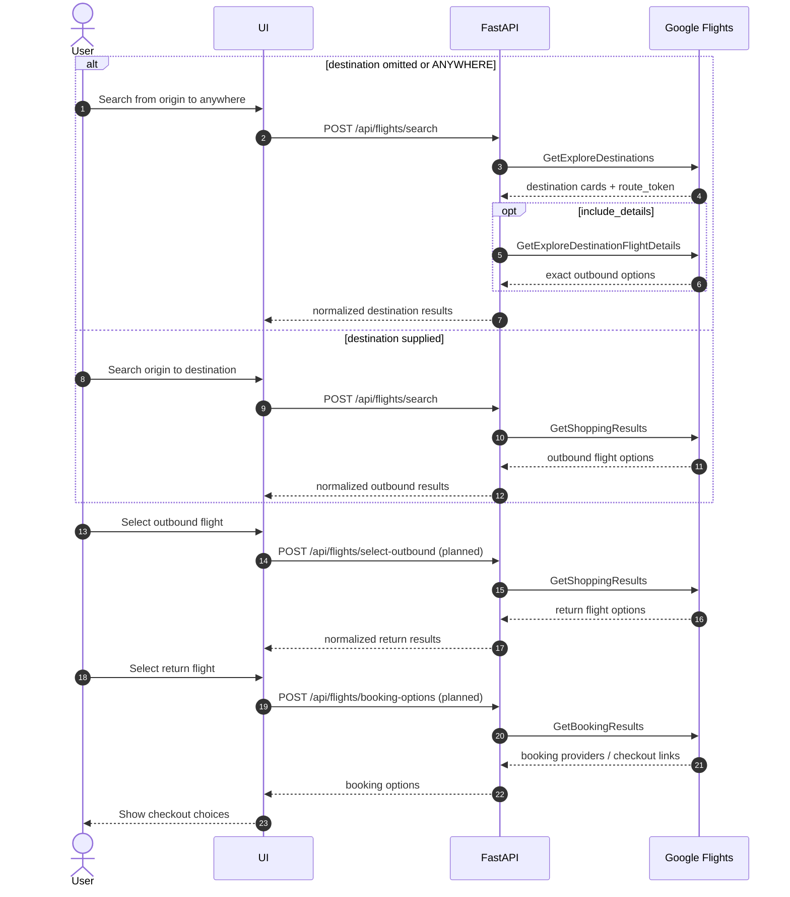

# Approach

## Product Shape

Flights Anywhere is now an AI destination discovery app, not just a flight API
wrapper. The first screen is a React/MUI interface with a compact search
toolbar, active filter chips, a pop-out filter drawer, recommendation cards,
and an AI chat panel. The backend remains FastAPI and continues to own the
Google Flights RPC integration.

This project exists because Google Flights offers a uniquely useful "anywhere"
discovery experience and rich shopping results, but there is no public API for
that surface. The interesting technical challenge is not scraping HTML; it is
understanding the browser RPC shape well enough to replay it reliably with
normal HTTP requests.

The app has three public surfaces:

- The web UI at `/`, served by FastAPI from the built Vite bundle.
- REST endpoints under `/api`.
- A stdio MCP server for agent and tool clients.

## Runtime Architecture

```text
React/MUI UI
  -> POST /api/travel/recommend
    -> TravelRecommendationService
      -> TravelIntentExtractor
      -> WeatherProvider / PlacesProvider
      -> GoogleFlightsService
        -> SessionManager
        -> entity resolver
        -> request builders
        -> Google Flights private RPC transport
        -> response parsers
      -> ranking and recommendation response
```

The Docker image builds the frontend first, copies `web/dist` into the Python
image, and runs one FastAPI process. That means `docker compose up --build`
starts both the UI and API on `http://localhost:8000/`.

## Key Decisions

- **One app container.** Compose runs a single FastAPI service that serves the
  frontend and API together.
- **Flight data is authoritative.** Gemini can interpret intent and help
  explain matches, but prices, durations, stops, route tokens, and
  availability come from Google Flights RPC responses.
- **Shared recommendation service.** REST endpoints and MCP tools call the
  same backend recommendation logic.
- **Simple filter UX.** The top toolbar only shows origin, dates, budget, and
  a filter icon. Advanced filters live in a drawer, and applied filters render
  as removable chips.
- **Flexible dates for cheapest trips.** The UI and API can switch from exact
  outbound and return dates to a flexible window, then search generated date
  pairs and keep the cheapest result per destination.
- **Swappable enrichment.** Weather and places matching are behind provider
  interfaces, so richer external MCP or API providers can replace the current
  deterministic profile providers later.
- **Use Playwright only for session refresh.** The API does not drive the full
  Google Flights UI for every query. Playwright captures fresh browser
  metadata, then HTTP requests do the search work.
- **Use a stable seed `f.req`.** Captured Google requests can have partial or
  page-specific shapes. The API keeps fresh cookies and session metadata but
  stores a known-good mutable request body.
- **Keep private workflow tokens opaque.** `route_token`, `option_token`, and
  `workflow_state` are returned so the API can continue the workflow without
  exposing Google internals as first-class client concepts.
- **Fail loudly but recover where possible.** Sessions refresh when missing,
  stale, malformed, or after a Google RPC failure.

## REST API

Core endpoints:

```text
GET  /healthz
POST /api/flights/search
POST /api/travel/filters/parse
POST /api/travel/recommend
```

`POST /api/flights/search` accepts direct structured flight searches:

```json
{
  "origin": "SFO",
  "destination": null,
  "outbound_date": "2026-08-01",
  "return_date": "2026-08-08",
  "nonstop": false,
  "include_details": true,
  "details_limit": 10
}
```

The endpoint uses one request schema and branches internally:

```text
destination omitted/null/ANYWHERE -> Explore workflow
destination supplied              -> Shopping workflow
```

The response uses one normalized flight-search envelope with mode, query,
results, and workflow state. Explore results can include opaque route and
option tokens for follow-on workflow steps.

`POST /api/travel/filters/parse` converts chat into structured filters without
running a flight search:

```json
{
  "message": "sunny next week under $1000",
  "filters": {
    "origin": "SFO",
    "domestic_international": "any",
    "climates": [],
    "vibes": [],
    "sort": "best_match"
  }
}
```

`POST /api/travel/recommend` runs the full recommendation flow and returns:

- assistant message
- applied filters
- active filter chips
- UI actions
- clarifying question, when origin or dates are missing
- ranked destination recommendations

Flexible-date recommendations use this filter shape:

```json
{
  "message": "find the cheapest 1 week trip any date in the next 6 months under $1000",
  "filters": {
    "origin": "SFO",
    "date_mode": "flexible",
    "trip_length_days": 7,
    "flexible_window": "next_6_months",
    "domestic_international": "any",
    "climates": [],
    "vibes": [],
    "sort": "cheapest"
  }
}
```

Supported `flexible_window` values are `next_month`, `next_3_months`, and
`next_6_months`.

Planned follow-on workflow endpoints are:

- `POST /api/flights/select-outbound`
- `POST /api/flights/booking-options`

## Recommendation Flow

1. Parse the user's message with deterministic heuristics first.
2. Use Gemini when the prompt needs model-backed interpretation and
   `GOOGLE_CLOUD_API_KEY` is available.
3. Merge extracted intent with current UI filters.
4. Ask one clarifying question if origin or dates are missing.
5. Search Google Flights through `GoogleFlightsService`; flexible-date mode
   expands into multiple generated outbound and return pairs and dedupes to the
   cheapest result per destination.
6. Enrich candidates with weather and places signals when relevant.
7. Rank by budget fit, flight quality, weather fit, places and vibe fit, and
   surprise factor.
8. Return recommendations grounded in real flight results.

Supported prompt styles include:

- `surprise me`
- `sunny next week under $1000`
- `somewhere tropical`
- `places with Japanese temples`
- `cheap beach trip`
- `cheapest 1 week trip any date in the next 6 months`

## MCP Server

Run:

```bash
python3 -m api.travel.mcp_server
```

Tools:

- `parse_travel_intent`
- `search_flights`
- `explore_destinations`
- `rank_destinations`
- `recommend_destinations`

The MCP server is intentionally thin. Tool wrappers validate payloads and then
call the same recommendation or flight services used by the REST API.

## Google Flights RPC Layer

All Google calls use:

```text
/_/FlightsFrontendUi/data/travel.frontend.flights.FlightsFrontendService/{RPC}
```

Relevant RPCs:

```text
GetExploreDestinations
GetExploreDestinationFlightDetails
GetShoppingResults
GetBookingResults
```

Implemented today:

- `GetExploreDestinations`
- `GetExploreDestinationFlightDetails`
- initial `GetShoppingResults` branch scaffold

Planned:

- selected-outbound `GetShoppingResults`
- `GetBookingResults`

### End-to-End Flight Search Flow



### Google Request Envelope

Google expects form-encoded RPC calls:

```text
POST application/x-www-form-urlencoded
f.req=[null,"<double-serialized request array>"]&at=<optional token>&
```

The API captures and stores:

- service URL with `f.sid`, `bl`, `hl`, and related query params
- browser headers and cookies
- optional `at`
- a stable seed `f.req`

The captured request body's original `f.req` is intentionally replaced with a
known-good seed shape. This avoids failures caused by Google emitting partial
page-specific request bodies during session capture.

### Internal Layers

```text
FastAPI route
  -> GoogleFlightsService
    -> SessionManager
    -> entity resolver
    -> request builders
    -> transport
    -> response parsers
    -> normalized Pydantic models
```

### Session Management

The API owns Google session state:

```text
api/.session/google_flights_session.json
```

`SessionManager`:

- caches sessions in memory
- persists sessions to `api/.session/`
- validates cached `f.req` leg shape
- refreshes with Playwright when missing, stale, malformed, or after a failed
  RPC
- uses a one-hour TTL by default

### Entity Resolution

Airport IATA codes are mapped to Google entity ids using:

```text
data/google_flights_entities.json
```

`ANYWHERE` maps to:

```text
/m/02j71
```

### Builders, Transport, And Parsers

Builders:

- mutate the stable seed `f.req`
- set origin and destination entity ids
- set outbound and return dates
- set nonstop flag
- produce Explore, Shopping, and details request bodies

Transport:

- swaps the RPC name in the captured service URL
- strips invalid replay headers such as `:authority`, `content-length`, `host`,
  and `accept-encoding`
- posts form bodies with `httpx`
- logs RPC start and end, status, elapsed time, and response bytes

Parsers:

- decode Google RPC response streams beginning with `)]}'`
- walk nested JSON arrays
- identify Explore destination rows
- identify flight option rows
- decode exact flight numbers from option tokens
- return normalized `FlightOption` objects

## Current Implementation

Implemented:

- API-owned session cache in `api/.session/`
- one-hour session TTL
- session refresh with Playwright
- malformed cached-session validation
- unified `POST /api/flights/search`
- Explore branch using `GetExploreDestinations`
- optional Explore route details using `GetExploreDestinationFlightDetails`
- Shopping branch scaffold using `GetShoppingResults`
- travel intent parsing and filter merging
- recommendation ranking with weather and places profile enrichment
- stdio MCP server wrappers for search and recommendation flows
- normalized result models
- `GET /healthz`
- web bundle served by FastAPI
- Docker and docker compose setup
- unit, integration, API-boundary, frontend, and E2E tests

Partially implemented:

- Shopping result parsing for outbound options
- exact flight-number extraction from encoded option tokens

Not yet implemented:

- selected-outbound return-option endpoint
- booking-provider endpoint over `GetBookingResults`
- full booking deep-link parser
- live weather or POI enrichment providers
- production rate limiting and backoff policy

## Deployment

Local all-in-one:

```bash
docker compose up --build
```

Railway uses `railway.json` with the Dockerfile builder and `/healthz` as the
health check path. The service should use the Dockerfile builder, not Railpack,
because the Dockerfile installs Playwright Chromium and its system dependencies.

Railway dashboard settings:

- Builder: `Dockerfile`
- Custom Build Command: leave blank
- Custom Start Command: leave blank, or use
  `sh -c 'uvicorn api.main:app --host 0.0.0.0 --port ${PORT:-8000}'`
- Healthcheck Path: `/healthz`

Required Railway variables:

- `ENVIRONMENT=production`
- `LOG_LEVEL=INFO`
- `GOOGLE_CLOUD_API_KEY`
- `GEMINI_MODEL=gemini-3.5-flash`
- `GOOGLE_FLIGHTS_SESSION_PATH=/app/api/.session/google_flights_session.json`
- `GOOGLE_FLIGHTS_SESSION_TTL_SECONDS=3600`
- `GOOGLE_FLIGHTS_SESSION_CAPTURE_TIMEOUT_SECONDS=45`
- `GOOGLE_FLIGHTS_SESSION_BOOTSTRAP_ORIGIN=SFO`

GitHub Actions is the deployment orchestrator for production. The CD workflow
syncs runtime values from GitHub secrets and variables into Railway with the
Railway CLI, then runs `railway up --detach --yes`.

Required GitHub Actions secrets:

- `RAILWAY_TOKEN`
- `GOOGLE_CLOUD_API_KEY`

Recommended GitHub Actions variables:

- `RAILWAY_SERVICE=flights-anywhere`
- `RAILWAY_ENVIRONMENT=production`
- `RAILWAY_PROJECT_ID`, if the repo is not linked to Railway
- `RAILWAY_PUBLIC_URL`, for the `/healthz` smoke test
- `GEMINI_MODEL=gemini-3.5-flash`
- `GOOGLE_FLIGHTS_SESSION_CAPTURE_TIMEOUT_SECONDS=45`
- `GOOGLE_FLIGHTS_SESSION_BOOTSTRAP_ORIGIN=SFO`

## Testing

Backend:

```bash
python3 -m unittest discover -v
```

Frontend:

```bash
npm run test --prefix web
npm run build --prefix web
```

Docker:

```bash
docker build -t flights-anywhere:test .
```

Current coverage includes:

- entity resolution
- `f.req` encode and decode
- stable seed request shape
- session TTL, corrupt-cache, and malformed-cache refresh behavior
- request builder mutation
- Explore parsing and dedupe
- option parsing and multi-flight-number extraction
- Explore details limit behavior
- HTTP retry after Google failures
- travel intent parsing and filter merging
- weather and places-aware ranking
- MCP wrapper smoke tests
- API error mapping and endpoint boundaries
- frontend filter, chat, and card states
- Playwright E2E loading and error discovery flows

## Known Limits

- Google Flights RPCs are private and can change without notice.
- Google may reject a browser session or require a new browser-side token.
- Private workflow tokens may expire quickly.
- Weather and places enrichment currently use deterministic profile providers,
  not live weather or POI APIs.
- Gemini is only called when heuristic extraction is insufficient; missing
  `GOOGLE_CLOUD_API_KEY` returns a clear unavailable error for model-required
  prompts.
- Booking-provider and deep-link parsing is still future work.
- The entity cache may need additional airports or city mappings.
- Excessive request volume can trigger rate limiting.

## Operational Notes

- Session files contain cookies and metadata; do not commit `api/.session/`.
- Use `docker compose down -v` to clear an old malformed session volume.
- Use `LOG_LEVEL=INFO` for useful runtime diagnostics.

## Future Work

1. Implement `POST /api/flights/select-outbound`.
2. Implement `POST /api/flights/booking-options`.
3. Add parser fixtures captured from real `GetShoppingResults` and
   `GetBookingResults` responses.
4. Add a small frontend for choosing outbound, return, and booking options.
5. Add request rate limiting, structured retries, and caching for popular
   searches.
