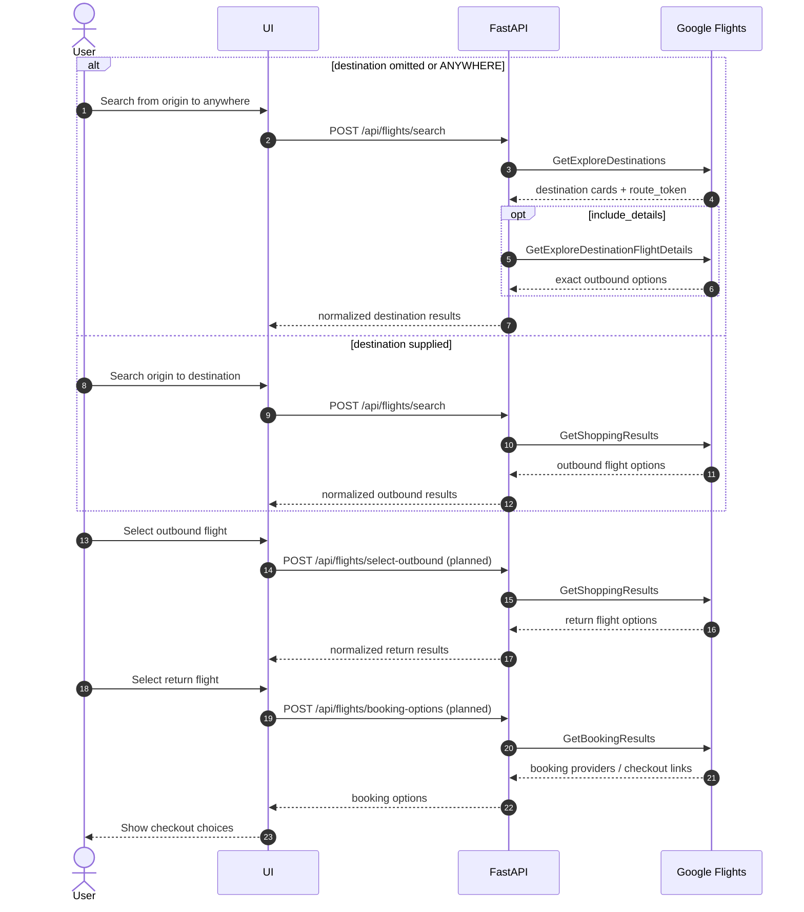

# Approach

## What This Builds

This project is a small FastAPI service that reverse-engineers Google Flights'
private browser RPCs and exposes a stable JSON API over them.

The primary endpoint is:

```text
POST /api/flights/search
```

The endpoint uses one request schema and branches internally:

```text
destination omitted/null/ANYWHERE -> Explore workflow
destination supplied              -> Shopping workflow
```

## Why This Problem

Google Flights has a uniquely useful "anywhere" discovery experience and rich
shopping results, but there is no public API for this surface. The interesting
technical challenge is not scraping HTML; it is understanding the browser RPC
shape well enough to replay it reliably with normal HTTP requests.

## Key Decisions

- **Use Playwright only for session refresh.** The API does not drive the full UI
  for every query. Playwright captures fresh browser metadata, then HTTP requests
  do the search work.
- **Use a stable seed `f.req`.** Captured Google requests can have partial or
  page-specific shapes. The API keeps fresh cookies/session metadata but stores a
  known-good mutable request body.
- **One public search API.** Explore and Shopping stay separate internally, but
  callers get one normalized response envelope.
- **Keep private tokens opaque.** `route_token`, `option_token`, and
  `workflow_state` are returned so the API can continue the workflow without
  exposing Google internals as first-class client concepts.
- **Fail loudly but recover where possible.** Sessions refresh when missing,
  stale, malformed, or after a Google RPC failure.

## End-to-End API Flow



## API Architecture

All Google calls use the same private service path:

```text
/_/FlightsFrontendUi/data/travel.frontend.flights.FlightsFrontendService/{RPC}
```

Relevant RPCs:

```text
GetExploreDestinations
GetExploreDestinationFlightDetails
GetShoppingResults
GetBookingResults
```

Implemented today:

- `GetExploreDestinations`
- `GetExploreDestinationFlightDetails`
- initial `GetShoppingResults` branch scaffold

Planned:

- selected-outbound `GetShoppingResults`
- `GetBookingResults`

### Google Request Envelope

Google expects form-encoded RPC calls:

```text
POST application/x-www-form-urlencoded
f.req=[null,"<double-serialized request array>"]&at=<optional token>&
```

The API captures and stores:

- service URL with `f.sid`, `bl`, `hl`, and related query params
- browser headers and cookies
- optional `at`
- a stable seed `f.req`

The captured request body's original `f.req` is intentionally replaced with a
known-good seed shape. This avoids failures caused by Google emitting partial
page-specific request bodies during session capture.

### Public API

```text
GET  /healthz
POST /api/flights/search
```

`GET /healthz` returns:

```json
{"status": "ok"}
```

`POST /api/flights/search` accepts:

```json
{
  "origin": "SFO",
  "destination": null,
  "outbound_date": "2026-08-01",
  "return_date": "2026-08-08",
  "nonstop": false,
  "include_details": true,
  "details_limit": 10
}
```

The response uses one normalized envelope:

```json
{
  "mode": "explore",
  "selection_stage": "results",
  "query": {
    "origin": "SFO",
    "destination": null,
    "outbound_date": "2026-08-01",
    "return_date": "2026-08-08"
  },
  "results": [
    {
      "source": "explore",
      "selection_stage": "destination",
      "origin": "SFO",
      "dest": "LAX",
      "price": 106,
      "currency": "USD",
      "airline": "Frontier",
      "stops": 0,
      "duration_minutes": 96,
      "flight_num": "F92858",
      "flight_nums": ["F92858"],
      "route_token": "...",
      "option_token": "...",
      "outbound_options": []
    }
  ],
  "workflow_state": {
    "mode": "explore",
    "can_select_outbound": false,
    "can_book": false
  }
}
```

### Internal Layers

```text
FastAPI route
  -> GoogleFlightsService
    -> SessionManager
    -> entity resolver
    -> request builders
    -> transport
    -> response parsers
    -> normalized Pydantic models
```

### Session Management

The API owns Google session state:

```text
api/.session/google_flights_session.json
```

`SessionManager`:

- caches sessions in memory
- persists sessions to `api/.session/`
- validates cached `f.req` leg shape
- refreshes with Playwright when missing, stale, malformed, or after a failed RPC
- uses a one-hour TTL by default

### Entity Resolution

Airport IATA codes are mapped to Google entity ids using:

```text
data/google_flights_entities.json
```

`ANYWHERE` maps to:

```text
/m/02j71
```

### Builders, Transport, And Parsers

Builders:

- mutate the stable seed `f.req`
- set origin/destination entity ids
- set outbound/return dates
- set nonstop flag
- produce Explore, Shopping, and details request bodies

Transport:

- swaps the RPC name in the captured service URL
- strips invalid replay headers such as `:authority`, `content-length`, `host`,
  and `accept-encoding`
- posts form bodies with `httpx`
- logs RPC start/end, status, elapsed time, and response bytes

Parsers:

- decode Google RPC response streams beginning with `)]}'`
- walk nested JSON arrays
- identify Explore destination rows
- identify flight option rows
- decode exact flight numbers from option tokens
- return normalized `FlightOption` objects

## Current Implementation

Implemented:

- API-owned session cache in `api/.session/`
- one-hour session TTL
- session refresh with Playwright
- malformed cached-session validation
- unified `POST /api/flights/search`
- Explore branch using `GetExploreDestinations`
- optional Explore route details using `GetExploreDestinationFlightDetails`
- Shopping branch scaffold using `GetShoppingResults`
- normalized result models
- `GET /healthz`
- Docker and docker compose setup
- unit, integration, and API-boundary tests

Partially implemented:

- Shopping result parsing for outbound options
- exact flight-number extraction from encoded option tokens

Not yet implemented:

- selected-outbound return-option endpoint
- booking-provider endpoint over `GetBookingResults`
- full booking deep-link parser
- production rate limiting / backoff policy

## What Breaks First

- Google may change the RPC payload shape.
- Google may reject a browser session or require a new browser-side token.
- The IATA-to-entity cache may miss airports.
- Private tokens may expire quickly.
- Excessive request volume can trigger rate limiting.

## What I Would Build Next

1. Implement `POST /api/flights/select-outbound`.
2. Implement `POST /api/flights/booking-options`.
3. Add parser fixtures captured from real `GetShoppingResults` and
   `GetBookingResults` responses.
4. Add a small frontend for choosing outbound/return/booking options.
5. Add request rate limiting, structured retries, and cache popular searches.

## Testing

Run:

```bash
python3 -m unittest discover -v
```

Current tests cover:

- entity resolution
- `f.req` encode/decode
- stable seed request shape
- session TTL/corrupt/malformed cache refresh
- builder mutation
- Explore parsing and dedupe
- option parsing and multi-flight-number extraction
- Explore details limit behavior
- HTTP retry after Google failures
- API error mapping
- `GET /healthz`

## Operational Notes

- These are private browser RPCs and can break if Google changes payload shape.
- Session files contain cookies and metadata; do not commit `api/.session/`.
- Use `docker compose down -v` to clear an old malformed session volume.
- Use `LOG_LEVEL=INFO` for useful runtime diagnostics.
