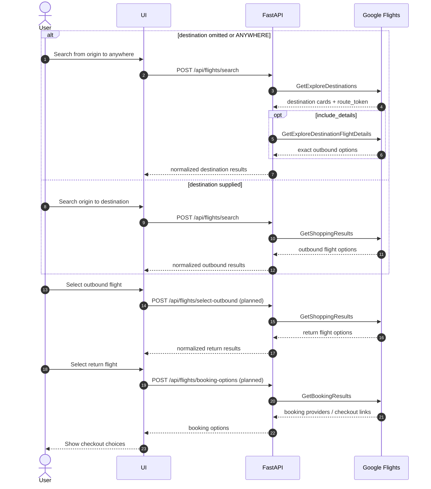

# Approach

## What This Builds

This project is a small FastAPI service that reverse-engineers Google Flights'
private browser RPCs and exposes a stable JSON API over them.

The primary endpoint is:

```text
POST /api/flights/search
```

The endpoint uses one request schema and branches internally:

```text
destination omitted/null/ANYWHERE -> Explore workflow
destination supplied              -> Shopping workflow
```

## Why This Problem

Google Flights has a uniquely useful "anywhere" discovery experience and rich
shopping results, but there is no public API for this surface. The interesting
technical challenge is not scraping HTML; it is understanding the browser RPC
shape well enough to replay it reliably with normal HTTP requests.

## Key Decisions

- **Use Playwright only for session refresh.** The API does not drive the full UI
  for every query. Playwright captures fresh browser metadata, then HTTP requests
  do the search work.
- **Use a stable seed `f.req`.** Captured Google requests can have partial or
  page-specific shapes. The API keeps fresh cookies/session metadata but stores a
  known-good mutable request body.
- **One public search API.** Explore and Shopping stay separate internally, but
  callers get one normalized response envelope.
- **Keep private tokens opaque.** `route_token`, `option_token`, and
  `workflow_state` are returned so the API can continue the workflow without
  exposing Google internals as first-class client concepts.
- **Fail loudly but recover where possible.** Sessions refresh when missing,
  stale, malformed, or after a Google RPC failure.

## End-to-End API Flow



## Current Implementation

Implemented:

- API-owned session cache in `api/.session/`
- one-hour session TTL
- session refresh with Playwright
- malformed cached-session validation
- unified `POST /api/flights/search`
- Explore branch using `GetExploreDestinations`
- optional Explore route details using `GetExploreDestinationFlightDetails`
- Shopping branch scaffold using `GetShoppingResults`
- normalized result models
- `GET /healthz`
- Docker and docker compose setup
- unit, integration, and API-boundary tests

Partially implemented:

- Shopping result parsing for outbound options
- exact flight-number extraction from encoded option tokens

Not yet implemented:

- selected-outbound return-option endpoint
- booking-provider endpoint over `GetBookingResults`
- full booking deep-link parser
- production rate limiting / backoff policy

## What Breaks First

- Google may change the RPC payload shape.
- Google may reject a browser session or require a new browser-side token.
- The IATA-to-entity cache may miss airports.
- Private tokens may expire quickly.
- Excessive request volume can trigger rate limiting.

## What I Would Build Next

1. Implement `POST /api/flights/select-outbound`.
2. Implement `POST /api/flights/booking-options`.
3. Add parser fixtures captured from real `GetShoppingResults` and
   `GetBookingResults` responses.
4. Add a small frontend for choosing outbound/return/booking options.
5. Add request rate limiting, structured retries, and cache popular searches.
