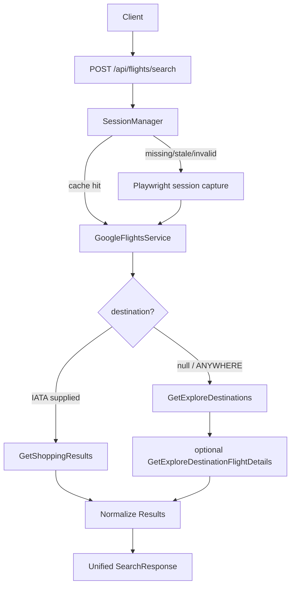

# Google Flights API Architecture

This service wraps private Google Flights browser RPCs behind a stable FastAPI
interface. Playwright is only used to refresh session metadata; normal HTTP
requests perform search and details calls.

## Google RPCs

All current calls share this service path:

```text
/_/FlightsFrontendUi/data/travel.frontend.flights.FlightsFrontendService/{RPC}
```

Current RPCs:

```text
GetExploreDestinations
GetExploreDestinationFlightDetails
GetShoppingResults
GetBookingResults
```

Implemented today:

- `GetExploreDestinations`
- `GetExploreDestinationFlightDetails`
- initial `GetShoppingResults` branch scaffold

Planned:

- selected-outbound `GetShoppingResults`
- `GetBookingResults`

## Request Envelope

Google expects form-encoded RPC calls:

```text
POST application/x-www-form-urlencoded
f.req=[null,"<double-serialized request array>"]&at=<optional token>&
```

The API captures and stores:

- service URL with `f.sid`, `bl`, `hl`, and related query params
- browser headers and cookies
- optional `at`
- a stable seed `f.req`

The captured request body's original `f.req` is intentionally replaced with a
known-good seed shape. This avoids failures caused by Google emitting partial
page-specific request bodies during session capture.

## Workflow



## Public API

### `GET /healthz`

Returns:

```json
{"status": "ok"}
```

### `POST /api/flights/search`

Request:

```json
{
  "origin": "SFO",
  "destination": null,
  "outbound_date": "2026-08-01",
  "return_date": "2026-08-08",
  "nonstop": false,
  "include_details": true,
  "details_limit": 10
}
```

Branching:

```text
destination omitted/null/ANYWHERE -> Explore branch
destination supplied              -> Shopping branch
```

Response:

```json
{
  "mode": "explore",
  "selection_stage": "results",
  "query": {
    "origin": "SFO",
    "destination": null,
    "outbound_date": "2026-08-01",
    "return_date": "2026-08-08"
  },
  "results": [
    {
      "source": "explore",
      "selection_stage": "destination",
      "origin": "SFO",
      "dest": "LAX",
      "price": 106,
      "currency": "USD",
      "airline": "Frontier",
      "stops": 0,
      "duration_minutes": 96,
      "flight_num": "F92858",
      "flight_nums": ["F92858"],
      "route_token": "...",
      "option_token": "...",
      "outbound_options": []
    }
  ],
  "workflow_state": {
    "mode": "explore",
    "can_select_outbound": false,
    "can_book": false
  }
}
```

## Internal Layers

```text
FastAPI route
  -> GoogleFlightsService
    -> SessionManager
    -> entity resolver
    -> request builders
    -> transport
    -> response parsers
    -> normalized Pydantic models
```

### SessionManager

Responsibilities:

- cache session in memory
- persist session at `api/.session/google_flights_session.json`
- validate cached `f.req` leg shape
- refresh with Playwright when missing, stale, malformed, or after a failed RPC
- default TTL: one hour

### Entity Resolver

Responsibilities:

- convert airport IATA code to Google entity id
- support `ANYWHERE` as `/m/02j71`
- fail clearly for unknown IATA codes

Source:

```text
data/google_flights_entities.json
```

### Builders

Responsibilities:

- mutate the stable seed `f.req`
- set origin/destination entity ids
- set outbound/return dates
- set nonstop flag
- produce Explore, Shopping, and details request bodies

### Transport

Responsibilities:

- swap RPC name in the captured service URL
- strip invalid replay headers such as `:authority`, `content-length`, `host`,
  and `accept-encoding`
- POST form body with `httpx`
- log RPC start/end, status, elapsed time, and response bytes

### Parsers

Responsibilities:

- decode Google RPC response streams beginning with `)]}'`
- walk nested JSON arrays
- identify Explore destination rows
- identify flight option rows
- decode exact flight numbers from option tokens
- return normalized `FlightOption` objects

## Explore Branch

Use when `destination` is omitted or `ANYWHERE`.

RPC sequence:

```text
GetExploreDestinations
optional GetExploreDestinationFlightDetails per route_token
```

Explore returns destination cards. Optional details enrich those cards with exact
outbound options when Google provides them.

## Shopping Branch

Use when `destination` is supplied.

Current RPC:

```text
GetShoppingResults
```

This branch is intended for exact route searches such as SFO to LAX. It should
eventually support:

1. initial outbound results
2. selected-outbound return results
3. selected round-trip booking providers

## Testing

Run:

```bash
python3 -m unittest discover -v
```

Current tests cover:

- entity resolution
- `f.req` encode/decode
- stable seed request shape
- session TTL/corrupt/malformed cache refresh
- builder mutation
- Explore parsing and dedupe
- option parsing and multi-flight-number extraction
- Explore details limit behavior
- HTTP retry after Google failures
- API error mapping
- `GET /healthz`

## Operational Notes

- These are private browser RPCs and can break if Google changes payload shape.
- Session files contain cookies and metadata; do not commit `api/.session/`.
- Use `docker compose down -v` to clear an old malformed session volume.
- Use `LOG_LEVEL=INFO` for useful runtime diagnostics.
